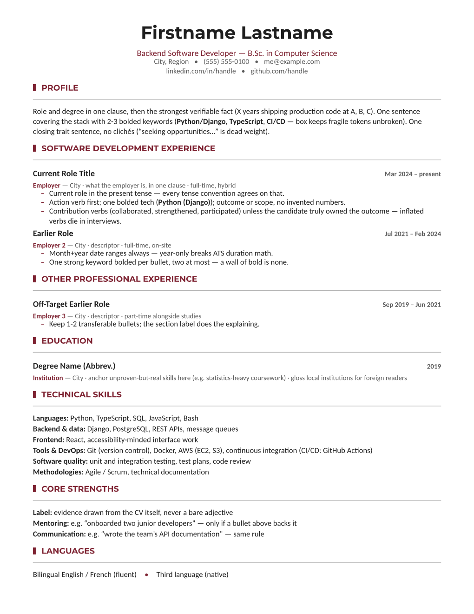

# vitae

An agent skill (Claude Code / compatible agents) for building résumés and CVs
in [Typst](https://typst.app) that pass **both** filters: automated screening
(ATS — Applicant Tracking Systems — and AI screeners) and the human 30-second
scan.

**Status: beta (0.1)** — the method is battle-tested, but the skill's file
layout and script interfaces may still change before 1.0.

Battle-tested method distilled from a real end-to-end résumé project that went
through six simulated adversarial hiring reviews (recruiter, hiring manager,
ATS expert, bank, startup, consulting firm) and a native-speaker language
review — then hardened by adversarial reviews of the skill itself (execution,
open-source, recruiting-expert) and cross-field integration simulations
(a French nurse's CV, a UK analyst's CV) run by agents using only these files.



## What it does

- **Exact page control**: 1-page and 2-page versions, deterministic page
  breaks, no section ever split across pages (unbreakable blocks).
- **Measured page fill**: last-ink target derived from the actual margins,
  verified by a pixel measurement script — with an explicit anti-filler rule.
- **Machine-parseable layout**: linear skill lines, month+year dates, clean
  `pdftotext` extraction, verified per build; covers legacy positional
  parsers and the newer semantic/LLM ATS layer.
- **Honesty-first content rules**: no invented facts (the rule outranks every
  layout guideline), no unproven keywords, no interview-fatal verb inflation,
  protected-title compliance.
- **Regional & multilingual**: paper size, photo policy (CV vs LinkedIn),
  verb and spelling conventions, section names, title law per market —
  Canada/Québec, USA, France, UK, Germany, and a verify-don't-guess rule for
  everything else.
- **Adversarial review loop**: parallel reviewer personas, invented-but-
  realistic job postings per market segment, findings applied only when they
  survive cross-examination.
- **Field packs**: the generic method plus per-field depth;
  `references/field-software-dev.md` ships first — contributions welcome for
  other fields.
- Optional companion deliverables (job-search guide, cover letters, LinkedIn
  checklist) via `references/companion-guide.md`.

## Install

Copy this folder to your agent's skills directory, e.g. for Claude Code:

```
~/.claude/skills/vitae/          # user-wide
<project>/.claude/skills/vitae/  # per-project
```

## Usage

In a Claude Code session, just ask naturally — the skill triggers on résumé/CV
work:

```
> Rebuild my CV from ~/old_cv.pdf and my LinkedIn, targeting backend roles in
  Toronto. One-page and two-page versions, English.
```

The agent will collect facts, pick the regional conventions, draft from the
template, verify page count / fill / extraction mechanically, and offer an
adversarial review pass before delivering PDFs + editable `.typ` sources.

## Requirements

`typst` (0.13+), `pdfinfo`/`pdftotext` (poppler-utils), Python 3 with Pillow
for the fill measurement. Run `scripts/check_env.sh` (any POSIX shell — Linux, macOS, WSL/Git Bash) or
`scripts\check_env.ps1` (Windows) to diagnose — the doctors are read-only and
print the right install command per platform; the opt-in `--install`/`-Install`
flag fetches only the typst binary to `~/.local/bin` (no root/admin), over
HTTPS from the official releases, **without checksum verification** — prefer
a package manager if that matters to you.

Platform notes:
- **Linux / macOS**: works as-is (Apple Silicon handled).
- **Windows** (baseline: Windows 11+, up to date): PowerShell doctor runs on
  the preinstalled 5.1; typst via `winget install --id Typst.Typst`; poppler
  via `choco install poppler` or `scoop install poppler` — or use WSL/Git
  Bash and follow the POSIX path instead. If PowerShell
  refuses to run the doctor ("running scripts is disabled"), run
  `Unblock-File .\check_env.ps1` then
  `powershell -ExecutionPolicy Bypass -File .\check_env.ps1`.
- **pip-only environments** (no package manager, no admin rights):
  `pip install typst pypdf Pillow` covers everything — `typst` compiles PDF
  and PNG through its Python API (no CLI), `pypdf` counts pages and gives an
  indicative text extraction. See `references/ats.md` for the commands and
  the known pypdf caveat.

## Layout

```
SKILL.md                         # workflow + non-negotiable rules (agent entry point)
references/design.md             # design system + page-fill tuning loop
references/ats.md                # parsing rules + verification commands
references/regional.md           # regional router: universal rules + matrix
references/regional/*.md         # per-market depth, loaded only for the target market
references/reviews.md            # adversarial review protocol
references/field-software-dev.md # field pack: software development
references/typst-primer.md       # minimal Typst syntax for agents that don't know it
references/companion-guide.md    # optional job-search guide recipe
templates/resume.typ             # annotated starting template
scripts/measure_fill.py          # ink-coverage measurement
scripts/verify.sh                # one-command gate: compile + pages + fill + extraction (POSIX shell)
scripts/check_env.sh             # environment doctor, POSIX shell (read-only)
scripts/check_env.ps1            # environment doctor, Windows PowerShell
assets/example-1page.png         # rendered template example
```

## Contributing

Issues and PRs welcome — field packs (nursing, finance, trades…) and regional
matrix rows are the highest-value contributions. Keep every claim verifiable;
validate with `npx skills-ref validate .` ([Agent Skills spec](https://agentskills.io/specification));
this skill's culture is "measured, not eyeballed".

## License

MIT — see [LICENSE](LICENSE).
