# vitae

An agent skill (Claude Code / compatible agents) for building résumés and CVs
in [Typst](https://typst.app) that pass **both** filters: automated screening
(ATS — Applicant Tracking Systems — and AI screeners) and the human 30-second
scan.

**Status: beta (0.2)** — the method is battle-tested, but the skill's file
layout and script interfaces may still change before 1.0.

Battle-tested method distilled from a real end-to-end résumé project that went
through six simulated adversarial hiring reviews (recruiter, hiring manager,
ATS expert, bank, startup, consulting firm) and a native-speaker language
review — then hardened by adversarial reviews of the skill itself (execution,
open-source, recruiting-expert) and cross-field integration simulations
(a French nurse's CV, a UK analyst's CV) run by agents using only these files.


## What it does

- **Exact page control**: 1-page and 2-page versions, deterministic page
  breaks, no section ever split across pages (unbreakable blocks).
- **Measured page fill**: last-ink target derived from the actual margins,
  verified by a pixel measurement script — with an explicit anti-filler rule.
- **Machine-parseable layout**: linear skill lines, month+year dates, clean
  `pdftotext` extraction, verified per build; covers legacy positional
  parsers and the newer semantic/LLM ATS layer.
- **Honesty-first content rules**: no invented facts (the rule outranks every
  layout guideline), no unproven keywords, no interview-fatal verb inflation,
  protected-title compliance.
- **Regional & multilingual**: paper size, photo policy (CV vs LinkedIn),
  verb and spelling conventions, section names, title law per market —
  Canada/Québec, USA, France, UK, Germany, and a verify-don't-guess rule for
  everything else.
- **Adversarial review loop**: parallel reviewer personas, invented-but-
  realistic job postings per market segment, findings applied only when they
  survive cross-examination.
- **Field packs**: the generic method plus per-field depth;
  `references/field-software-dev.md` ships first — contributions welcome for
  other fields.
- **Anti-clone design system**: fourteen design families across four
  registers (modern, neutral, classic, creative) anchored in real design
  currents, drawn deterministically per candidate (`scripts/pick_design.py`);
  generative palettes validated for contrast (`scripts/gen_palette.py`); font
  pairs drawn from open-license pools — so the tool never converges on one
  recognizable look. The creative register is never in the default draw pool
  — unlocked by a creative target field or an explicit request, and capped
  back out by a conservative market. One family (`gutter-rail`) carries a
  second lock on top of that one: its ruled gutter is a code gutter, so it
  also requires a technical target field, and the creative unlock alone never
  draws it for a non-technical trade. Reference implementations of all
  fourteen families live in `templates/families/`.
- Optional companion deliverables (job-search guide, cover letters, LinkedIn
  checklist) via `references/companion-guide.md`.

## Design families

Fourteen reference implementations, one per family, live under
`templates/families/<name>/`. Full recipes (heading device, header
composition, fonts, boundary treatment) are in `references/design.md`; this
is the one-line summary of each, rendered.

<table>
<tr>
<td align="center">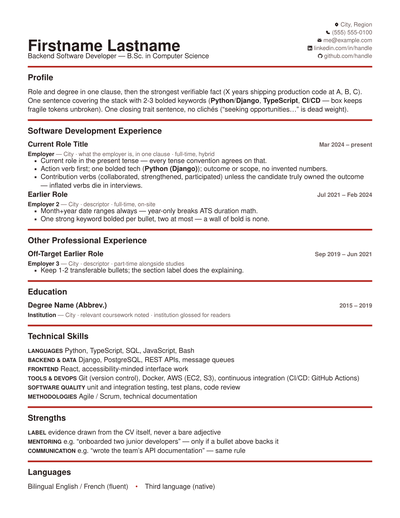<br><sub><b>swiss-grid</b> · neutral</sub></td>
<td>International Typographic Style: flush-left grid, accent rule above the title, no colour on text.</td>
<td align="center">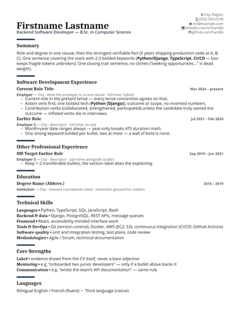<br><sub><b>editorial-serif</b> · classic</sub></td>
<td>Contemporary editorial: serif display over a humanist sans body, short accent bar above the title.</td>
</tr>
<tr>
<td align="center">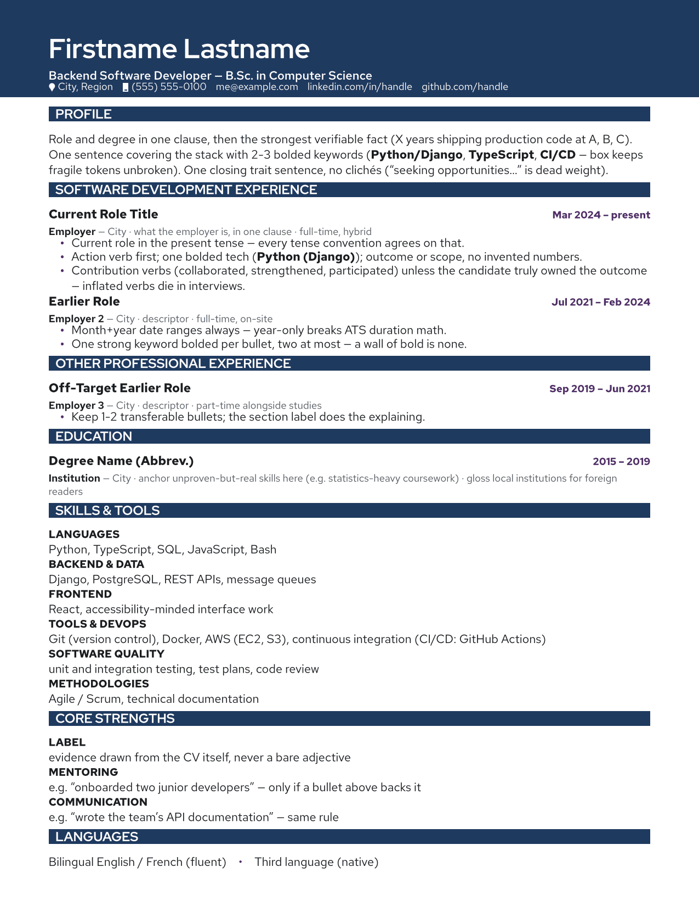<br><sub><b>color-band</b> · modern</sub></td>
<td>Reversed-out masthead: the heading is knocked out white on a solid accent band.</td>
<td align="center">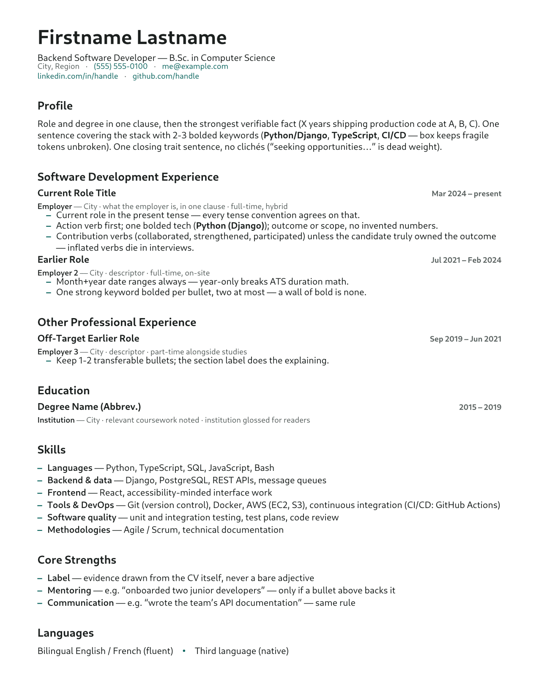<br><sub><b>humanist-quiet</b> · neutral</sub></td>
<td>Restraint, no rules at all: one humanist sans, no heading device, whitespace alone carries the boundary.</td>
</tr>
<tr>
<td align="center">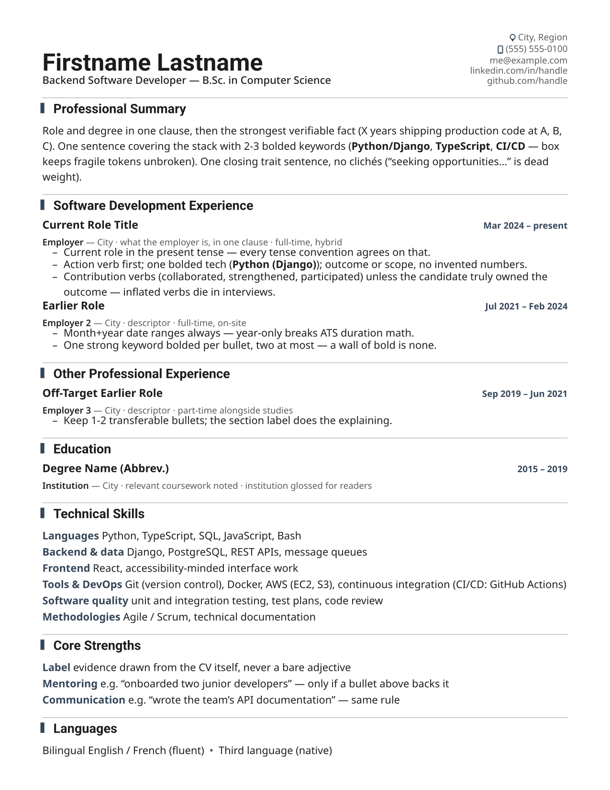<br><sub><b>keyline-corporate</b> · modern</sub></td>
<td>Contemporary corporate report: an accent keyline runs down the left of each title, with a soft rule across each section boundary.</td>
<td align="center">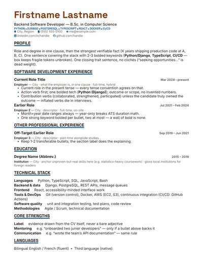<br><sub><b>bold-display</b> · modern</sub></td>
<td>Geometric display, heavy contrast: UPPERCASE display title over a heavy rule.</td>
</tr>
<tr>
<td align="center">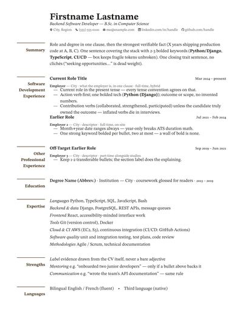<br><sub><b>margin-index</b> · classic</sub></td>
<td>Classic marginalia: titles live in a wide left-margin column, serif with old-style figures.</td>
<td align="center">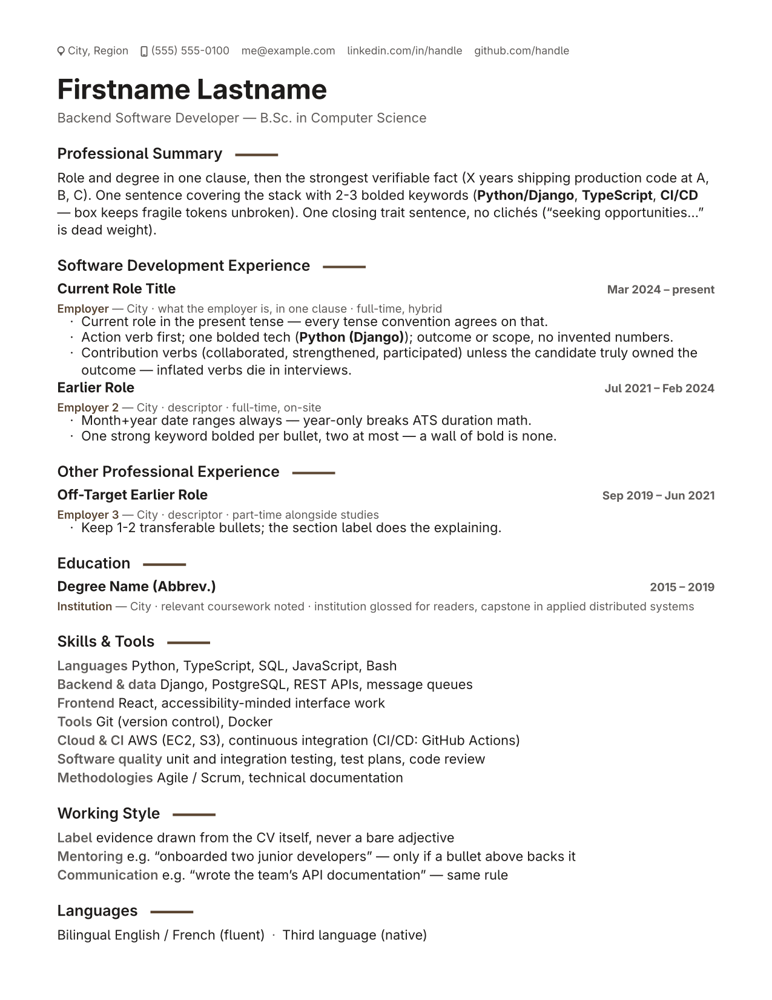<br><sub><b>quiet-luxury</b> · neutral</sub></td>
<td>Warm restrained minimalism: warm humanist sans, a short accent tick beside the title.</td>
</tr>
<tr>
<td align="center">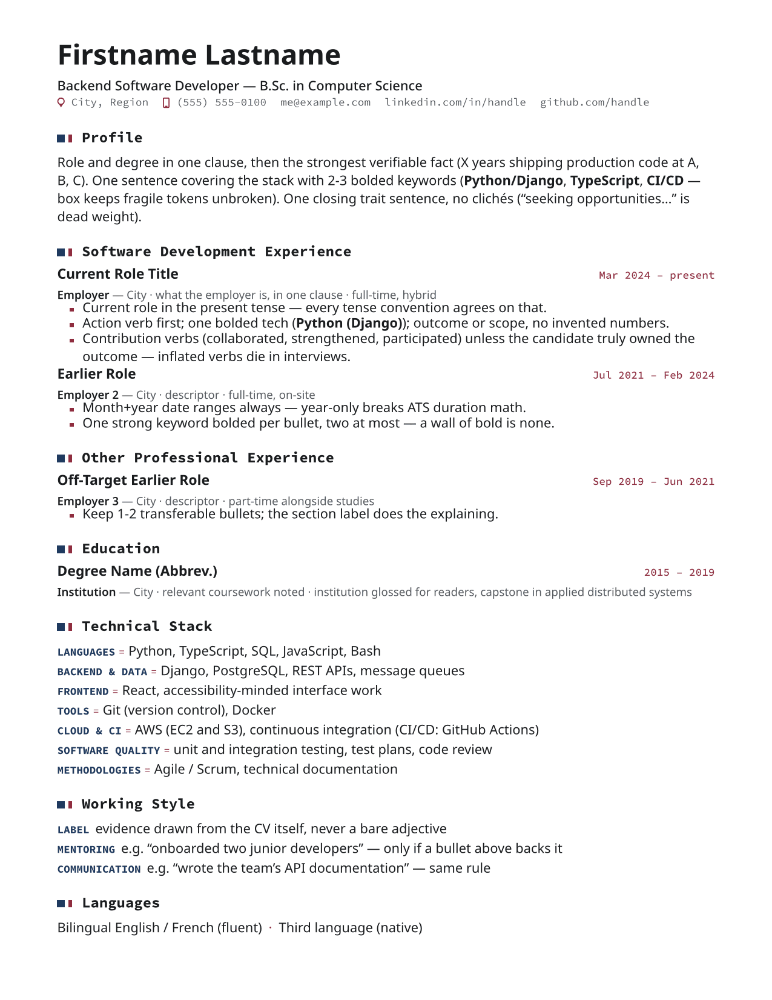<br><sub><b>mono-technical</b> · modern</sub></td>
<td>Technical-documentation aesthetic: filled hue-A/hue-B marker glyphs, monospace throughout.</td>
<td align="center">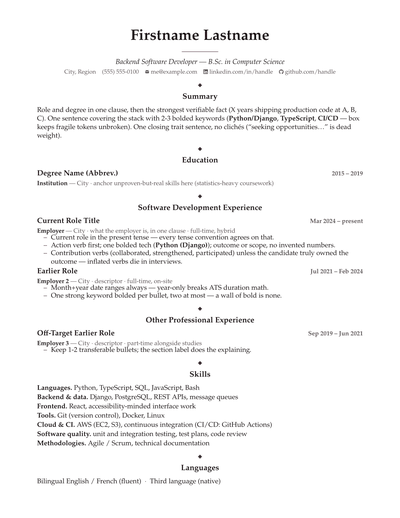<br><sub><b>engraved-card</b> · classic</sub></td>
<td>Engraved stationery: a rotated accent lozenge, quiet serif, airy margins.</td>
</tr>
<tr>
<td align="center">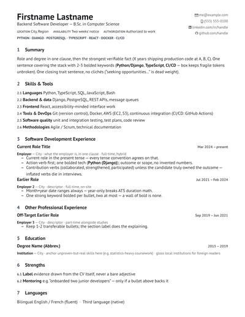<br><sub><b>clause-index</b> · neutral</sub></td>
<td>Numbered-clause standard document: outdented clause numbers, institutional grotesque with tabular figures.</td>
<td align="center">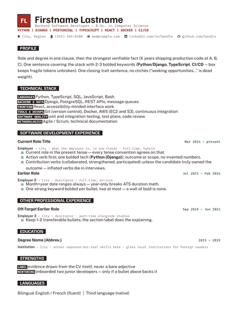<br><sub><b>hard-edge</b> · creative</sub></td>
<td>Neo-brutalist: the title is knocked out of a hard black slab; heavy grotesque + document mono.</td>
</tr>
<tr>
<td align="center">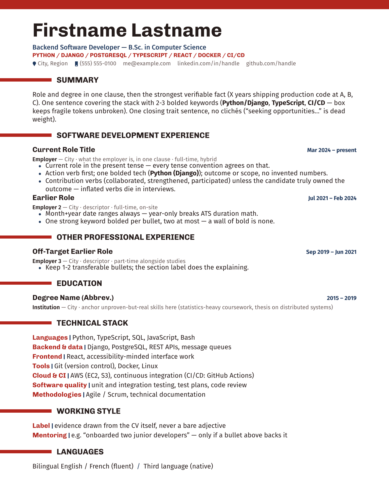<br><sub><b>avant-poster</b> · creative</sub></td>
<td>Constructivist poster: a heavy accent bar bleeds off the page edge, condensed grotesque display.</td>
<td align="center">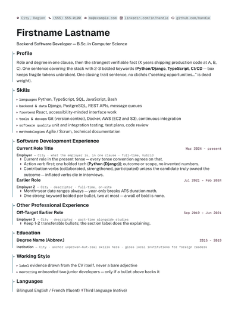<br><sub><b>gutter-rail</b> · creative</sub></td>
<td>Themed developer environment: a gutter rail runs down the margin, UI grotesque + mono chrome.</td>
</tr>
</table>

The `creative` register (`hard-edge`, `avant-poster`, `gutter-rail`) is never
drawn by default — see § Design families in `references/design.md`.

## Install

Copy this folder to your agent's skills directory, e.g. for Claude Code:

```
~/.claude/skills/vitae/          # user-wide
<project>/.claude/skills/vitae/  # per-project
```

## Usage

In a Claude Code session, just ask naturally — the skill triggers on résumé/CV
work:

```
> Rebuild my CV from ~/old_cv.pdf and my LinkedIn, targeting backend roles in
  Toronto. One-page and two-page versions, English.
```

The agent will collect facts, pick the regional conventions, draft from the
template, verify page count / fill / extraction mechanically, and offer an
adversarial review pass before delivering PDFs + editable `.typ` sources.

## Requirements

`typst` (0.13+) and Python 3 with Pillow for the fill measurement.
`pdfinfo`/`pdftotext` (poppler-utils) recommended; falls back to `pypdf`
automatically when only that is installed. Run `python3 scripts/verify.py
--doctor` (any platform) to diagnose — read-only, prints the right install
command per platform, official repos first. LibreOffice/soffice is optional,
only needed to generate editable copies (.docx/.odt) derived from the
compiled PDF.

Platform notes:
- **Linux / macOS**: works as-is (Apple Silicon handled).
- **Windows** (baseline: Windows 11+, up to date): `python scripts\verify.py
  --doctor` runs directly, no PowerShell doctor involved; typst via
  `winget install --id Typst.Typst`; poppler via `choco install poppler` or
  `scoop install poppler` — or use WSL/Git Bash and follow the POSIX path
  (`scripts/verify.sh`, a wrapper around `verify.py`) instead.
- **pip-only environments** (no package manager, no admin rights):
  `pip install typst pypdf Pillow` covers everything — `typst` compiles PDF
  and PNG through its Python API (no CLI), `pypdf` counts pages and gives an
  indicative text extraction. See `references/ats.md` for the commands and
  the known pypdf caveat.

## Layout

```
SKILL.md                         # workflow + non-negotiable rules (agent entry point)
references/design.md             # design system + page-fill tuning loop
references/ats.md                # parsing rules + verification commands
references/regional.md           # regional router: universal rules + matrix
references/regional/*.md         # per-market depth, loaded only for the target market
references/reviews.md            # adversarial review protocol
references/field-software-dev.md # field pack: software development
references/typst-primer.md       # minimal Typst syntax for agents that don't know it
references/companion-guide.md    # optional job-search guide recipe
references/fonts.md              # font provenance: Google Fonts URLs, licences, both install routes
templates/resume.typ             # annotated starting template
templates/lib.typ                # shared verified mechanics (devices stay per-family); hand-off is these two files
templates/families/<family>/     # REFERENCE IMPLEMENTATIONS of all fourteen design families
  resume.typ                     #   font pair A — the family's primary draw
  resume-pair-b.typ              #   font pair B — the SAME family on its second font pair, to prove
                                 #   the recipe survives a different pair (not a page 2)
  lib.typ                        #   symlink to ../../lib.typ — one source of truth, no copies
templates/families/swiss-grid/resume-2page.typ   # the worked 2-page sample (runhead, deliberate break, both pages measured)
scripts/pick_design.py           # deterministic design draw: family, fonts, section labels, list markers; --emit-typ prints the ready-to-paste Typst preamble for the drawn recipe
scripts/gen_palette.py           # generative, contrast-validated palettes (duotone included)
scripts/measure_fill.py          # ink-coverage measurement
scripts/verify.py                # gate + doctor: compile + pages + fill + extraction, any platform; --tune bisects #set par(leading:, spacing:) to the fill target (does not replace the gate — run it after)
scripts/verify.sh                # POSIX wrapper around verify.py (2 lines)
assets/example-1page.png         # rendered template example
```

## Contributing

Issues and PRs welcome — field packs (nursing, finance, trades…) and regional
matrix rows are the highest-value contributions. Keep every claim verifiable;
validate with `npx skills-ref validate .` ([Agent Skills spec](https://agentskills.io/specification));
this skill's culture is "measured, not eyeballed".

## License

MIT — see [LICENSE](LICENSE).

**Third-party.** Every inlined mark in `templates/lib.typ` is path data under
**MIT**: the brand marks (LinkedIn, GitHub) from
[Bootstrap Icons](https://github.com/twbs/icons), the generic marks (email,
phone, pin, website) from [Tabler Icons](https://github.com/tabler/tabler-icons)'
filled set. Only path data is used; no font file, CSS or JavaScript is
redistributed. Refresh any of them with
`scripts/harvest_icons.py <set> <var>=<icon> --update templates/lib.typ`.

The brand marks were previously Simple Icons (CC0). Bootstrap Icons was
preferred not for the licence — CC0 is more permissive than MIT and imposes
nothing — but because Simple Icons withdrew the LinkedIn mark under LinkedIn's
own brand guidelines, freezing that path at tag 13.21.0 where no refresh can
reach it. Note that a licence covers the drawing, never the trademark: using
either logo on a CV is nominative use, which is a separate question from
redistributing the path. No font binaries ship with this skill either: the
pools name faces packaged by common Linux distributions or available from
Google Fonts under the SIL Open Font License 1.1 — see
[`references/fonts.md`](references/fonts.md) for provenance and installation.
